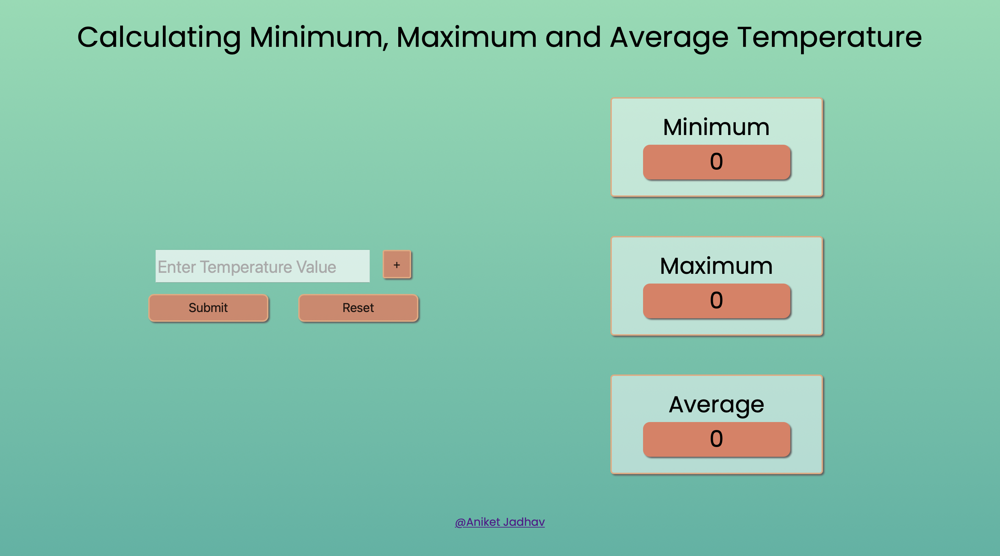

# Min-Max-and-Avg-Temperature
Open index.html in code editor and run live server.
The code will update min, max and avg in console every second.

I have also developed a small web app to take inputs from users and calculate the values.

You can run index.html in any of the folders to run the app.

App in two different folders is the same, I have just tried two different style of code.

